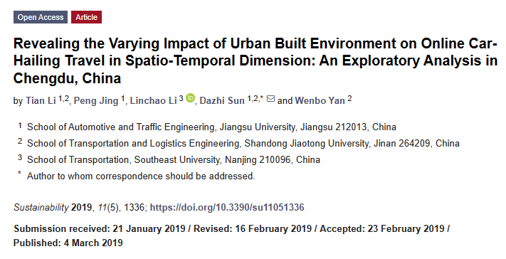
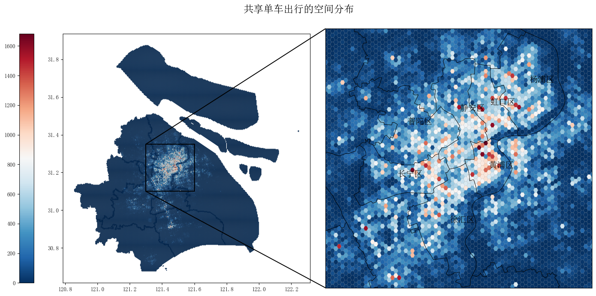
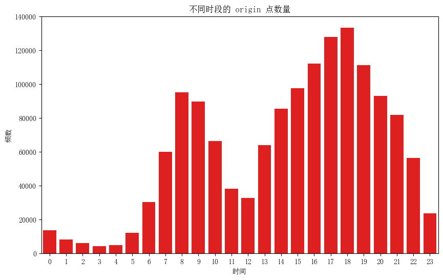
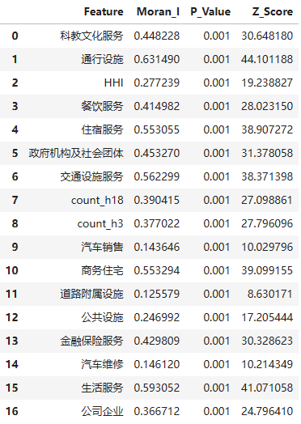
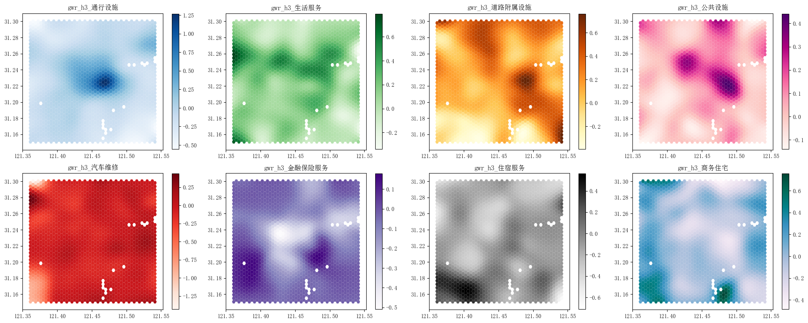
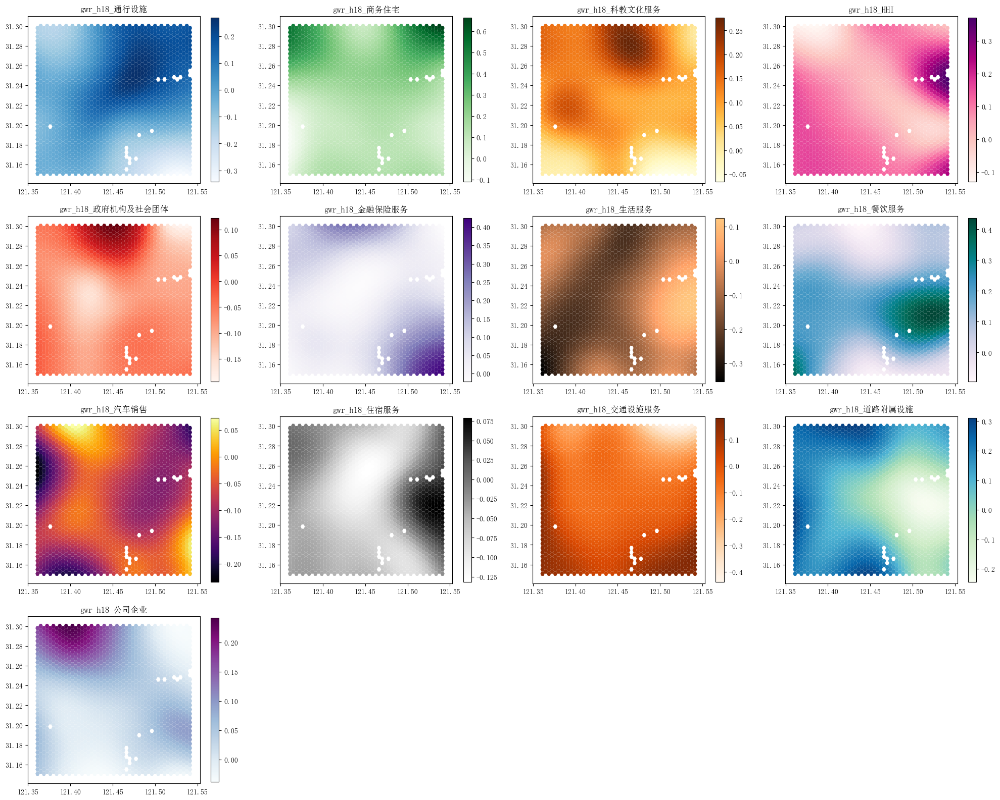

# 简介

参考文献：[Revealing the Varying Impact of Urban Built Environment on Online Car-Hailing Travel in Spatio-Temporal Dimension: An Exploratory Analysis in Chengdu, China](https://www.mdpi.com/2071-1050/11/5/1336)

 

2018年8月26日的上海市共享单车的空间分布：

 

- 使用上海市共享单车数据和POI数据，数据时间均为2018年
- 使用逐步回归确定需要的城市环境变量-自变量
- 分别选择3点和18点的共享单车出行数据作为因变量：出行差异大
  

 
- 使用地理加权回归模型进行分析

# 结果

各变量莫兰指数：

 

3点的结果：

 
  
18点的结果：

 

- 很明显，这些变量在空间上对共享单车出行的影响不同
